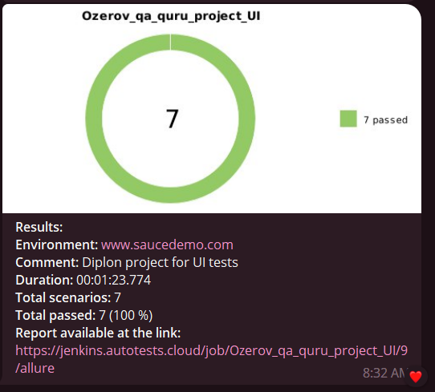

# Пример проекта UI автотестов на демо-интернет-магазина "https://www.saucedemo.com/"
> www.saucedemo.com - это набор обучающих страниц по функционалу интернет-магазина.

### Используемые технологии
<p  align="center">
  <code></code>
  <code></code>
  <code></code>
  <code></code>
  <code></code>
  <code></code>
  <code></code>
  <code></code>
  <code></code>
  <code></code>
</p>

## Покрываемый функционал
- Проверка успешной авторизации в интернет-магазин.
- Проверка авторизации с пустыми полями.
- Проверка авторизации под заблокированным пользователем.
- Проверка авторизации с не корректными данными для авторизации.
- Проверка добавления товара в корзину.
- Проверка удаления товара в корзину.
- Проверка оформления заказа.


## Запуск тестов
#### По умолчанию все тесты запускаются удалённо на Selenoid

### Для локального запуска
1. Склонировать репозиторий ($ git clone [Git repo](https://github.com/Obrams/qa_guru_project_UI))
2. Откройте проект в PyCharm
3. Введите в терминале команду
``` 
python -m venv .venv
source .venv/bin/activate
pip install -r requirements.txt
pytest .
```

### Запуск тестов в [Jenkins](https://jenkins.autotests.cloud/job/Ozerov_qa_quru_project_UI)
Нажмите кнопку «Собрать сейчас»
<p></p>

Для удалённого запуска API-тестов, в разделе **Сборка**, необходимо добавить шаг по созданию/изменению .env-файла с данными вашей учетной записи сервиса <code>www.saucedemo.com</code>(**username_shop**, **password_shop**, **block_username_shop**, **block_password_shop**, **uncorrected_username_shop**, **uncorrected_password_shop**).

Пример файла <code>.env</code> в [Jenkins](https://jenkins.autotests.cloud/job/Ozerov_qa_quru_project_UI/configure)


Примечание данные для авторизации тестовые.

###  Отчетность о прохождении тестов в Allure
#### Если тест запускался локально:
Введите в терминале команду 
```
allure serve allure-results
``` 
#### Если тест запускался в Jenkins
Нажмите Allure Report или кликните по иконке отчёта в завершённой сборке
<p></p>

### Примеры отображения тестов


#### Так же в отчетах для каждого UI-теста прикрепляется видео


### <p> Telegram</p>
<p>Настроена отправка отчета в <a href='https://t.me/aqa_report_bot'>Telegram</a></p>
